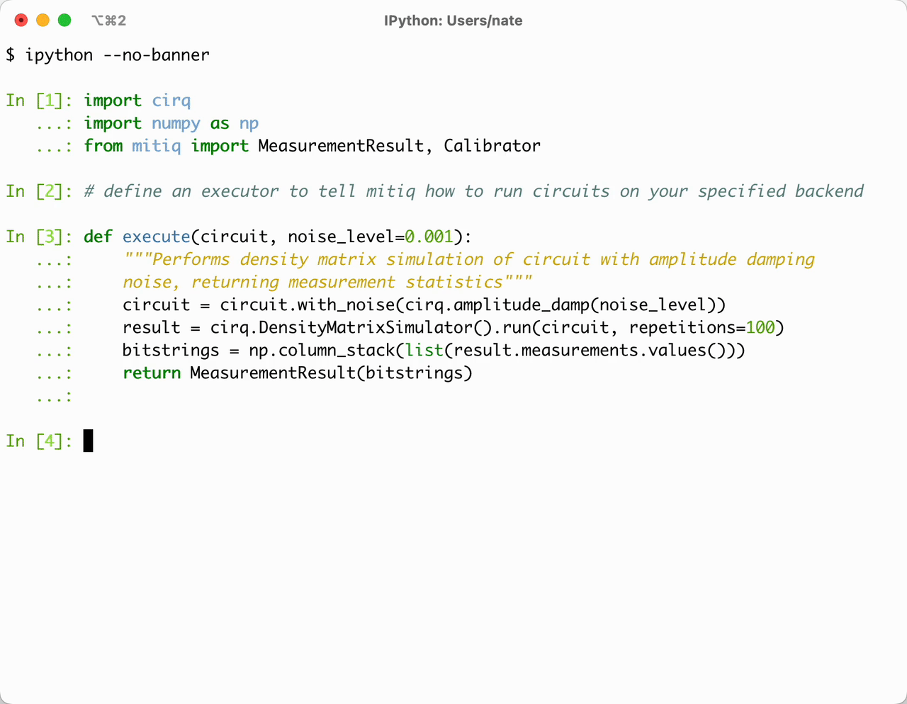

# <a href="https://github.com/unitaryfund/mitiq"></a>

[](https://github.com/unitaryfund/mitiq/actions)
[](https://mitiq.readthedocs.io/en/stable/)
[](https://codecov.io/gh/unitaryfund/mitiq)
[](https://badge.fury.io/py/mitiq)
[](https://arxiv.org/abs/2009.04417)
[](https://pepy.tech/project/mitiq)
[](https://github.com/unitaryfund/mitiq)
[](https://unitary.fund)
[](http://discord.unitary.fund)

Mitiq is a Python toolkit for implementing error mitigation techniques on
quantum computers.

Current quantum computers are noisy due to interactions with the environment,
imperfect gate applications, state preparation and measurement errors, etc.
Error mitigation seeks to reduce these effects at the software level by
compiling quantum programs in clever ways.

Want to know more? Check out our
[documentation](https://mitiq.readthedocs.io/en/stable/guide/guide.html), chat with us on [Discord](http://discord.unitary.fund), and join our weekly community call ([public agenda](https://docs.google.com/document/d/1lZfct4AOCS7fdyWkudcGyER0n0nsCxSFKSicUEeJgtA/)).

## Quickstart

### Installation

```bash
pip install mitiq
```

### Example

Define a function which inputs a circuit and returns an expectation value you want to compute, then use Mitiq to mitigate errors.

```python
import cirq
from mitiq import zne, benchmarks


def execute(circuit, noise_level=0.005):
    """Returns Tr[ρ |0⟩⟨0|] where ρ is the state prepared by the circuit
    with depolarizing noise."""
    noisy_circuit = circuit.with_noise(cirq.depolarize(p=noise_level))
    return (
        cirq.DensityMatrixSimulator()
        .simulate(noisy_circuit)
        .final_density_matrix[0, 0]
        .real
    )


circuit = benchmarks.generate_rb_circuits(n_qubits=1, num_cliffords=50)[0]

true_value = execute(circuit, noise_level=0.0)      # Ideal quantum computer
noisy_value = execute(circuit)                      # Noisy quantum computer
zne_value = zne.execute_with_zne(circuit, execute)  # Noisy quantum computer + Mitiq

print(f"Error w/o  Mitiq: {abs((true_value - noisy_value) / true_value):.3f}")
print(f"Error w Mitiq:    {abs((true_value - zne_value) / true_value):.3f}")
```

Sample output:

```
Error w/o  Mitiq: 0.264
Error w Mitiq:    0.073
```

### Calibration

Unsure which error mitigation technique or parameters to use?
Try out the calibration module demonstrated below to help find the best parameters for your particular backend!



See our [guides](https://mitiq.readthedocs.io/en/stable/guide/guide.html) and [examples](https://mitiq.readthedocs.io/en/stable/examples/examples.html) for more explanation, techniques, and benchmarks.

## Quick Tour

### Error mitigation techniques

| Technique                                 | Documentation                                                | Mitiq module                                                              | Paper Reference(s)                                                                                                                                 |
| ----------------------------------------- | ------------------------------------------------------------ | ------------------------------------------------------------------------- | -------------------------------------------------------------------------------------------------------------------------------------------------- |
| Zero-noise extrapolation                  | [ZNE](https://mitiq.readthedocs.io/en/latest/guide/zne.html) | [`mitiq.zne`](https://github.com/unitaryfund/mitiq/tree/main/mitiq/zne) | [1611.09301](https://arxiv.org/abs/1611.09301)<br>[1612.02058](https://arxiv.org/abs/1612.02058)<br>[1805.04492](https://arxiv.org/abs/1805.04492) |
| Probabilistic error cancellation          | [PEC](https://mitiq.readthedocs.io/en/latest/guide/pec.html) | [`mitiq.pec`](https://github.com/unitaryfund/mitiq/tree/main/mitiq/pec) | [1612.02058](https://arxiv.org/abs/1612.02058)<br>[1712.09271](https://arxiv.org/abs/1712.09271)<br>[1905.10135](https://arxiv.org/abs/1905.10135) |
| (Variable-noise) Clifford data regression | [CDR](https://mitiq.readthedocs.io/en/latest/guide/cdr.html) | [`mitiq.cdr`](https://github.com/unitaryfund/mitiq/tree/main/mitiq/cdr) | [2005.10189](https://arxiv.org/abs/2005.10189)<br>[2011.01157](https://arxiv.org/abs/2011.01157)                                                   |
| Digital dynamical decoupling              | [DDD](https://mitiq.readthedocs.io/en/latest/guide/ddd.html) | [`mitiq.ddd`](https://github.com/unitaryfund/mitiq/tree/main/mitiq/ddd) | [9803057](https://arxiv.org/abs/quant-ph/9803057)<br>[1807.08768](https://arxiv.org/abs/1807.08768)                                                |
| Readout-error mitigation                  | [REM](https://mitiq.readthedocs.io/en/latest/guide/rem.html) | [`mitiq.rem`](https://github.com/unitaryfund/mitiq/tree/main/mitiq/rem) | [1907.08518](https://arxiv.org/abs/1907.08518) <br>[2006.14044](https://arxiv.org/abs/2006.14044)                                                  |

See our [roadmap](https://github.com/unitaryfund/mitiq/wiki) for additional candidate techniques to implement. If there is a technique you are looking for, please file a [feature request](https://github.com/unitaryfund/mitiq/issues/new?assignees=&labels=feature-request&template=feature_request.md&title=).

### Interface

We refer to any programming language you can write quantum circuits in as a _frontend_, and any quantum computer / simulator you can simulate circuits in as a _backend_.

#### Supported frontends

| [Cirq](https://quantumai.google/cirq)                                                                                                                                         | [Qiskit](https://qiskit.org/)                                                                                         | [pyQuil](https://github.com/rigetti/pyquil)                                                                                                             | [Braket](https://github.com/aws/amazon-braket-sdk-python)                                                                                                                         | [PennyLane](https://pennylane.ai/)                                                                                                  |[Qibo](https://qibo.science/)                                                                                                  |
|:-----:|:-----:|:-----:|:-----:|:-----:|:-----:|
| <a href="https://quantumai.google/cirq"></a> | <a href="https://qiskit.org/"></a> | <a href="https://github.com/rigetti/pyquil"></a> | <a href="https://github.com/aws/amazon-braket-sdk-python"></a> | <a href="https://pennylane.ai/"></a> | <a href="https://qibo.science/"></a> |

You can install Mitiq support for these frontends by specifying them during installation, 
as optional extras, along with the main package.
To install Mitiq with one or more frontends, you can specify each frontend in square brackets as part of the installation command. 

For example, 
to install Mitiq with support for Qiskit and Qibo:
```bash
pip install mitiq[qiskit,qibo]
```

[Here](https://github.com/unitaryfund/mitiq/blob/main/INTEGRATIONS.txt) is an up-to-date list of supported frontends. 

Note: Currently, Cirq is a core requirement of Mitiq and is installed when you `pip install mitiq` (even without the optional `[cirq]`)

#### Supported backends

You can use Mitiq with any backend you have access to that can interface with supported frontends.

### Citing Mitiq

If you use Mitiq in your research, please reference the [Mitiq whitepaper](https://quantum-journal.org/papers/q-2022-08-11-774/) using the bibtex entry found in [`CITATION.bib`](https://github.com/unitaryfund/mitiq/blob/main/CITATION.bib).

A list of papers citing Mitiq can be found on [Google Scholar](https://scholar.google.com/scholar?cites=12810395086731011605) / [Semantic Scholar](https://api.semanticscholar.org/CorpusID:221555755?).

## License

[GNU GPL v.3.0.](https://github.com/unitaryfund/mitiq/blob/main/LICENSE)

## Contributing

We welcome contributions to Mitiq including bug fixes, feature requests, etc. To get started, check out our [contribution
guidelines](https://mitiq.readthedocs.io/en/stable/toc_contributing.html) and/or [documentation guidelines](https://mitiq.readthedocs.io/en/stable/contributing_docs.html).

## Contributors ✨

Thank you to all of the [wonderful people](https://github.com/unitaryfund/mitiq/graphs/contributors) that have made this project possible.
Non-code contributors are also much appreciated, and are listed here.
Thank you to

- [@francespoblete](https://github.com/francespoblete) for much of Mitiq's design work/vision

Contributions of any kind are welcome!
