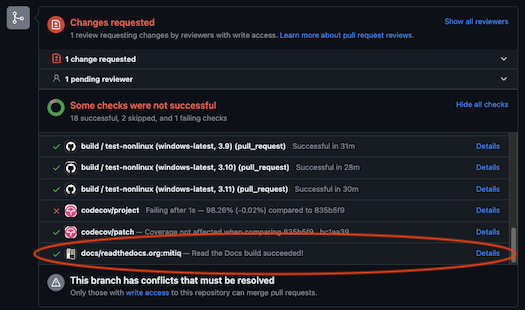
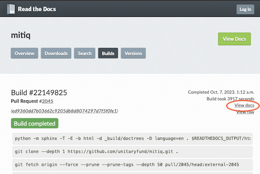

# Contributing to the Documentation
This is the contributors guide for the documentation of Mitiq,
the Python toolkit for implementing error mitigation on quantum computers.

## Requirements
Our documentation is generated with
[Sphinx](https://www.sphinx-doc.org/en/master/usage/installation.html).
The necessary packages can be installed, from the root Mitiq directory
```bash
pip install -e .
pip install -r dev_requirements.txt
```
as they are included in the `dev_requirements.txt` file.
Alternately, you can use the docker image provided in the repo and all requirements for working with the docs are already installed there.

### Sphinx extensions used to build the docs
- [`myst-nb`](https://myst-nb.readthedocs.io/en/latest/) and [`myst-parser`](https://myst-parser.readthedocs.io/en/latest/) allow both markdown and jupyter notebooks to be included and run by the Sphinx build. Also adds support for [MyST markdown](https://myst-parser.readthedocs.io/en/latest/using/syntax.html) spec.
- [`sphinxcontrib-bibtex`](https://sphinxcontrib-bibtex.readthedocs.io/en/latest/) allows to include citations in a `.bib` file.
- [`pybtex`](https://pybtex.org/) allows to customize how citations are rendered, e.g., APS-style.
- [`sphinx-copybutton`](https://sphinx-copybutton.readthedocs.io/en/latest/) allows to easily copy-paste code snippets from examples.
- [`sphinx-autodoc-typehints`](https://pypi.org/project/sphinx-autodoc-typehints/) allows to control how annotations are displayed in the API-doc part of the documentation, integrating with  [`sphinx-autodoc`](https://www.sphinx-doc.org/en/master/usage/extensions/autodoc.html) and [`sphinx-napoleon`](https://sphinxcontrib-napoleon.readthedocs.io/en/latest/) which handle specific styling requirements for the API documentation comments.

You can check that Sphinx is installed with `sphinx-build --version`.

### The configuration file
Since the documentation is already created, you need not to generate a
configuration file from scratch (this is done with `sphinx-quickstart`).
Meta-data, extensions and other custom specifications are accounted for
in the `conf.py` file.

### Add/change Sphinx features in the conf.py file

To add specific feature to the documentation, Sphinx extensions can be added to the build.
As and example, to add classes and functions to the API doc, make sure that autodoc
extension is enabled in the `conf.py` file.

```python
extensions = ['sphinx.ext.autodoc']
```

## Updating the Documentation

Documentation is found in `docs/source`, and is divided into the following sections:

-  a **guide**, whose content needs to be
written from scratch, 
- **examples** which can be either jupyter notebooks or MyST formatted notebooks, and
- an **API-doc** part, which is (mostly)
automatically generated.

Information in the docs should be added as markdown files using the MyST markdown syntax.
If you are adding a new file (as opposed to editing an existing one), ensure to add it to an associated TOC so that it is discoverable.

The main table of contents (TOC) file for the docs is `index.md`. It includes `guide\guide.md` and `apidoc.md`, among other files. To add a new file to the base TOC, make sure it gets listed in the `toctree` directive like this:
````
```{toctree}
---
maxdepth: 2 
caption: Contents
---
file.md
```
````

```{tip}
If you use VS Code as your text editor there is a nice extension that does syntax highlighting for MyST: [https://marketplace.visualstudio.com/items?itemName=ExecutableBookProject.myst-highlight](https://marketplace.visualstudio.com/items?itemName=ExecutableBookProject.myst-highlight)
```

### Including other files in the docs 

To include `.md` files outside of the documentation `source` directory, you can add a stub `*.md` file to the toctree inside the `docs/source` directory that contains:

````
```{include} path/to/file.md
:relative-docs: docs/
:relative-images:
```
````

where `file.md` is the one to be added. For more information on including files external to the docs, see the [MyST docs](https://myst-parser.readthedocs.io/en/latest/).

### Adding files to the user guide

To add information in the guide, please add markdown (`.md`) files to the `docs/guide` directory.
Remember to add new files to the guide's TOC file `docs/source/guide/guide.md`.

### Adding workflow image to the user guide

To insert a workflow to the user's guide of some new technique, the following template is available. The following image is
also available in the `svg` format at .. |mitiq_template.svg| image:: ../img/general_template.svg

```{figure} ../img/mitiq_workflow_template.png
---
width: 700px
name: figzne-overview
---
The diagram shows the workflow template of a new technique in Mitiq.
```


### Adding code examples

All code examples, besides explanations on the use of core software package features, live in the `examples` directory under `docs/source`. You can add
Jupyter notebooks (`.ipynb`) or MyST markdown notebooks, but MyST formatting will be preferred as it is much easier to diff in version control.

If you have a notebook you want to add, and want to automatically convert it from the `.ipynb` to `.md`, you can use a great Python command line tool called [jupytext](https://jupytext.readthedocs.io/en/latest/index.html).
To convert from an IPython notebook to markdown file, run `jupytext your_filename.ipynb --to myst` and find the converted file at `your_filename.md`.

Futher, not only can `jupytext` convert between the formats on demand, but once you install it, you can configure it to manage _both_ a Jupyter and Markdown version of your file, so you don't have to remember to do conversions (for more details, see the `jupytext` docs on [paired notebooks](https://jupytext.readthedocs.io/en/latest/index.html#paired-notebooks).
Using the paired notebooks you can continue your development in the notebooks as normal, and just commit to git the markdown serialized version when you want to add to the docs.
You can even add this tool as a [git pre-commit hook](https://jupytext.readthedocs.io/en/latest/using-pre-commit.html) if you want!

```{tip}
There is a [sample markdown formatted notebook in the `examples` directory](./examples/template.md) for you to take a look at as you write your own!
```

### Automatically add information from the API docs

New modules, classes and functions can be added by listing them in the appropriate file (such as `apidoc.md` or a child), e.g.,

````
## New Module
```{eval-rst}
.. automodule:: mitiq.new_module
   :members:
```
````
will add all elements of the `mitiq.new_module` module with a subtitle "New Module." 
You can hand-pick classes and functions to add, to comment them, as well as exclude them.

```{warning}
The `eval-rst` directive must be used for now as [myst-parser](https://github.com/executablebooks/MyST-Parser) only supports parsing docstrings as RST.
Once <https://github.com/executablebooks/MyST-Parser/issues/228> is closed, we can migrate to markdown docstrings.
```

```{tip}
If you are adding new features to Mitiq, make sure to add API docs in the
source code, and to the API page `apidoc.md`.
```

### Adding references 

To add references to the [Mitiq bibliography](https://mitiq.readthedocs.io/en/stable/bibliography.html), the first step is to add the reference to `docs/source/refs.bib` which is organized alphabetically. For formatting, please see BibTeX documentation for [articles](https://www.bibtex.com/e/article-entry/), [books](https://www.bibtex.com/e/book-entry/), and [others](https://www.bibtex.com/e/entry-types/).

Once the reference has been added to the `docs/source/refs.bib` file, cite the reference in the file by using:
```md
{cite}`title of entry`
```

## Build the documentation locally
The easiest way to build the docs is to run `make docs` from the project 
root directory, which builds the html docs output.

```{tip}
If you want a fresh build with no caching, run `make docs-clean`!
```

To call sphinx directly, `cd` into the `docs` directory and run
```bash
sphinx-build -b html source build
```

These commands generate the `docs/build` folder, which is ignore by the `.gitignore` file.
Once the documentation is generated you can view it by opening it in your browser.

## Testing the Documentation 

When writing a new code example in the docs, you can use different directives 
to include code blocks. 

### Just the code, don't evaluate
If you want to include a code snippet that doesn't get run (but has syntax
highlighting), use the `code-block` directive:

````
```{code-block} python
   1+1        # simple example
```
````

## View the documentation from a PR build

To preview the documentation (mitiq.readthedocs.io) from a specific build in a PR, click `Details` on the `docs/readthedocs.org:mitiq` line of the pull request's merge box in the PR's Conversation timeline. It may be necessary to scroll down to find the `docs/readthedocs.org:mitiq` line.



If the Read the Docs build failed, it is still possible to see the documentation from the build by clicking `Details` and then clicking on the `View docs` link on the right side of screen under the time it took for the build to complete.



## Additional information
[Here](https://github.com/nathanshammah/scikit-project/blob/master/5-docs.md)
are some notes on how to build docs.

[The MyST syntax guide](https://myst-parser.readthedocs.io/en/latest/using/syntax.html) is a
cheat sheet for the extended Markdown formatting that applies to both Markdown files as well as Markdown in Jupyter notebooks.

[The MyST-NB Notebook guide](https://myst-nb.readthedocs.io/en/latest/authoring/basics.html?highlight=markdown#myst-markdown) can help you get you write or convert your notebook content for the docs.
