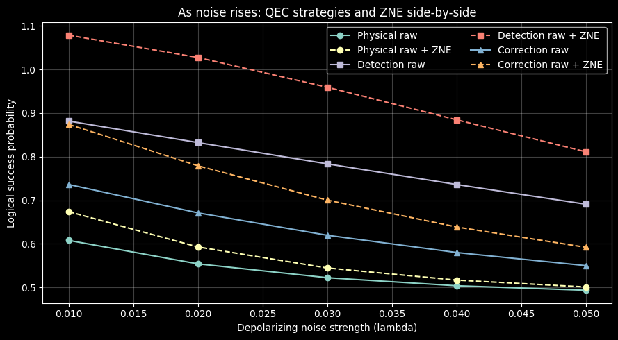

---
jupytext:
  text_representation:
    extension: .md
    format_name: myst
    format_version: 0.13
    jupytext_version: 1.11.1
kernelspec:
  display_name: Python 3 (ipykernel)
  language: python
  name: python3
---

```{tags} qibo, zne, intermediate
```

# Combining error correction and mitigation with Mitiq + Qibo

A fragile package moving through multiple delivery hubs needs more than one
layer of defense. One layer of protection (good packaging) helps, but it
is not always enough. You may also add inspection checkpoints and then review
delivery data to estimate how the package would have done on a smoother route.
This tutorial applies the same idea to quantum circuits: use a code to protect
information, use checks to filter suspicious outcomes, and use mitigation to
estimate a cleaner final result.

This tutorial shows one simple workflow where we combine:

1. an error-correcting code (the 3-qubit repetition code),
2. an error-detection strategy (post-selection on the code space),
3. and error mitigation with [Zero Noise Extrapolation](../guide/zne.md) (ZNE) in Mitiq.

The setup stays small so the main idea is easy to see.

## Quick picture

Think of this as a 3-step plan against noise:

1. **Catch mistakes early** with a small code.
2. **Filter bad outcomes** (detection) or **vote on the likely right bit** (correction).
3. **Use ZNE** to estimate what the result would be with less noise.

If you are new to this, the message is simple:
we stack imperfect tools so they help each other.

Another way to say it:
- QEC ideas help clean up errors,
- ZNE helps estimate what is left after cleanup.

## Imports

```{code-cell} ipython3
import os
os.environ["QIBO_LOG_LEVEL"] = "3"  # suppress Qibo INFO logging

import matplotlib.pyplot as plt
import numpy as np
from qibo import Circuit, gates
from mitiq import zne
from mitiq.zne.inference import LinearFactory
from mitiq.zne.scaling import fold_global
```

## Build a deeper memory benchmark

Now zoom in on the package before it enters the network.
You can ship one fragile box and hope for the best, or add protective structure
and tracking tags so damage is easier to detect and handle. This section follows
that logic for quantum information. A single qubit is the one-box baseline.
The encoded version adds redundancy plus syndrome checks, so we can react to
errors instead of silently absorbing them. We then keep the state alive through
extra memory rounds to stress-test that protection over longer runtime.

We prepare a target state (\(|1\rangle\)) in two ways:

- physical: one qubit in \(|1\rangle\),
- encoded: three data qubits (\(|111\rangle\)) plus helper ancilla qubits.

In plain words:
- **physical** is the simple baseline,
- **encoded** adds backup copies so we can spot or fix bit-flip errors.

Why 3 qubits?
It is the smallest repetition code that can correct one bit-flip.
So it stays easy to follow but still behaves like real QEC.

To make this closer to practice, we add **memory rounds**.
Each round adds extra gates that ideally do nothing, but increase circuit depth.
More depth means more noise exposure, which makes the ZNE test more meaningful.

For the encoded workflow, we repeat syndrome checks:
- one ancilla checks parity \(Z_1 Z_2\),
- one ancilla checks parity \(Z_2 Z_3\).

On real hardware, ancillas are often measured and reset each round.
Here we keep it simple: we use fresh ancillas each round and measure at the end.

```{code-cell} ipython3
def make_physical_logical_one(rounds=12):
    circuit = Circuit(1, density_matrix=True)
    circuit.add(gates.X(0))
    for _ in range(rounds):
        # Identity block: increases depth while keeping ideal logical state unchanged.
        circuit.add(gates.X(0))
        circuit.add(gates.X(0))
        circuit.add(gates.H(0))
        circuit.add(gates.H(0))
    return circuit


def make_encoded_logical_one(rounds=3):
    nqubits = 3 + 2 * rounds  # 3 data qubits + 2 ancillas per round
    circuit = Circuit(nqubits, density_matrix=True)

    # Encode |1>_L = |111>
    circuit.add(gates.X(0))
    circuit.add(gates.CNOT(0, 1))
    circuit.add(gates.CNOT(0, 2))

    for round_idx in range(rounds):
        ancilla_12 = 3 + 2 * round_idx
        ancilla_23 = ancilla_12 + 1

        # Syndrome extraction: Z1Z2 and Z2Z3 parities.
        circuit.add(gates.CNOT(0, ancilla_12))
        circuit.add(gates.CNOT(1, ancilla_12))
        circuit.add(gates.CNOT(1, ancilla_23))
        circuit.add(gates.CNOT(2, ancilla_23))

        # Identity-like logical memory block.
        circuit.add(gates.CNOT(0, 1))
        circuit.add(gates.CNOT(1, 2))
        circuit.add(gates.CNOT(1, 2))
        circuit.add(gates.CNOT(0, 1))
    return circuit
```

## Add a noise model closer to hardware behavior

Even with good packaging, transport itself introduces two pressures.
Some hits are sudden and random at each stop, while other wear builds up
gradually over total travel time. Quantum circuits show the same pattern.
If we model only one failure mode, results can look better than they really are.
So this tutorial uses mixed noise: one channel for random gate-level disturbances,
and one channel for time-dependent drift and loss. That gives a more honest test
for QEC + mitigation behavior.

For this benchmark, we mix two common noise sources:

1. **Depolarizing noise** (random gate errors),
2. **Thermal relaxation noise** with \(T_1\) and \(T_2\)-like parameters
   (energy loss and dephasing over gate time).

This is still simplified, but it is closer to real behavior than depolarizing-only noise.

### What is a depolarizing channel?

In simple words: after a gate, we sometimes randomize the qubit a bit.
This models random mistakes from an imperfect device.

### What are \(T_1\) and \(T_2\)-style effects?

- \(T_1\): qubits lose energy and drift toward \(|0\rangle\),
- \(T_2\): phase information slowly gets scrambled.

This makes runtime matter, which is one reason we included memory rounds.

### Why density-matrix simulation?

Many tutorials use finite shots, which add sampling noise.
Here we use density-matrix simulation to reduce that extra noise, so trends are easier to see.

In short:
- **shots** are realistic but noisy,
- **density matrix** is cleaner for learning and comparison.

```{code-cell} ipython3
def add_noise(
    circuit,
    lam=0.01,
    t1=80.0,
    t2=60.0,
    single_gate_time=1.0,
    two_qubit_gate_time=2.0,
):
    noisy = Circuit(circuit.nqubits, density_matrix=True)
    for gate in circuit.queue:
        noisy.add(gate)
        if isinstance(gate, (gates.M, gates.Channel)):
            continue
        if len(gate.qubits) == 1:
            q = gate.qubits[0]
            noisy.add(gates.DepolarizingChannel(q, lam=lam))
            noisy.add(
                gates.ThermalRelaxationChannel(
                    q, [t1, t2, single_gate_time, 0.0]
                )
            )
        else:
            noisy.add(gates.DepolarizingChannel(gate.qubits, lam=min(2 * lam, 0.25)))
            for q in gate.qubits:
                noisy.add(
                    gates.ThermalRelaxationChannel(
                        q, [t1, t2, two_qubit_gate_time, 0.0]
                    )
                )
    return noisy
```

## Define executors for three strategies

At this stage, imagine three shipping policies for the same fragile package.
Policy one sends it with minimal protection and accepts every delivery.
Policy two adds strict checkpoints and discards shipments that fail inspection.
Policy three uses checkpoint data to repair likely labeling mistakes before final
acceptance. The three executors below mirror those choices for quantum runs.

We track logical \(\langle Z \rangle\). For ideal logical \(|1\rangle\), this value is \(-1\).

1. **Physical baseline**: single-qubit circuit, no code.
2. **Error detection**: encoded circuit with post-selection based on repeated zero syndromes.
3. **Error correction**: encoded circuit with syndrome-guided classical correction.

These three executors answer one practical question:
"If I spend extra effort on coding + mitigation, do I actually gain anything?"

Plain-language meaning of each strategy:
- **Physical baseline**: one qubit, no safety net.
- **Detection**: keep only outcomes where all syndrome pairs are `00`.
  This is stricter than checking one round.
- **Correction**: use the latest syndrome to guess where a bit-flip happened,
  fix it in classical post-processing, then decode.

Technically, these executors isolate different error-management costs.
Detection usually improves trust in kept samples but lowers throughput because many outcomes are dropped.
Correction keeps more outcomes, but it depends on the syndrome-to-error mapping being accurate enough.
By comparing all three under the same noise model, we can separate "better physics" from "stricter filtering."

```{code-cell} ipython3
def bitstring(index, nqubits):
    return format(index, f"0{nqubits}b")


def data_majority(bitstr):
    return 1 if bitstr[:3].count("1") >= 2 else 0


def syndrome_rounds(bitstr, rounds):
    syndromes = []
    for r in range(rounds):
        ancilla_12 = 3 + 2 * r
        ancilla_23 = ancilla_12 + 1
        syndromes.append((int(bitstr[ancilla_12]), int(bitstr[ancilla_23])))
    return syndromes


SYNDROME_TO_ERROR = {
    (0, 0): None,
    (1, 0): 0,
    (1, 1): 1,
    (0, 1): 2,
}


def physical_executor(circuit, **noise_model):
    probs = add_noise(circuit, **noise_model)().probabilities()
    p1 = probs[1]
    return 1 - 2 * p1


def detection_stats(circuit, rounds=3, **noise_model):
    probs = add_noise(circuit, **noise_model)().probabilities()
    accepted_prob = 0.0
    logical_one_given_accepted = 0.0
    nqubits = circuit.nqubits

    for idx, prob in enumerate(probs):
        if prob == 0:
            continue
        bits = bitstring(idx, nqubits)
        syndromes = syndrome_rounds(bits, rounds)
        if all(s == (0, 0) for s in syndromes):
            accepted_prob += prob
            if data_majority(bits) == 1:
                logical_one_given_accepted += prob

    if accepted_prob == 0:
        return 0.0, 0.0
    p1 = logical_one_given_accepted / accepted_prob
    return 1 - 2 * p1, accepted_prob


def detection_executor(circuit, rounds=3, **noise_model):
    expval, _ = detection_stats(circuit, rounds=rounds, **noise_model)
    return expval


def correction_executor(circuit, rounds=3, **noise_model):
    probs = add_noise(circuit, **noise_model)().probabilities()
    logical_one_prob = 0.0
    nqubits = circuit.nqubits

    for idx, prob in enumerate(probs):
        if prob == 0:
            continue
        bits = bitstring(idx, nqubits)
        data = [int(b) for b in bits[:3]]
        syndromes = syndrome_rounds(bits, rounds)

        # Use latest syndrome as correction trigger.
        error_qubit = SYNDROME_TO_ERROR.get(syndromes[-1])
        if error_qubit is not None:
            data[error_qubit] ^= 1

        logical_one = 1 if sum(data) >= 2 else 0
        if logical_one:
            logical_one_prob += prob

    return 1 - 2 * logical_one_prob


def z_to_success_probability(expval_z):
    # For a logical |1> target, p_success = P(logical 1) = (1 - <Z>) / 2.
    return (1 - expval_z) / 2
```

## Run the three strategies with and without ZNE

Now we keep the shipping policy fixed, but vary route roughness in a controlled way.
Think of sending the same package through low-, medium-, and high-stress routes,
then using that trend to estimate how it would perform on an ideal smooth route.
That is the role of ZNE here: controlled stress tests plus a zero-noise estimate.

Here we run each strategy twice:
- once as-is ("Raw"),
- once with Mitiq ZNE ("Raw + ZNE").

This gives a direct side-by-side comparison.

What ZNE does (simple view):
1. Create noisier versions of the same circuit (`scale_factors=[1, 2, 3]`).
2. Measure the observable at each noise level.
3. Extrapolate back toward the zero-noise limit.

Why `fold_global`:
it is a common scaling method that stretches the circuit in a clear, repeatable way.

Technically, this section gives two useful checks at once:
1. **absolute performance** (`raw` vs `raw+ZNE`) for each strategy, and
2. **relative value of structure** (physical vs detection vs correction) under
the same noise model and extrapolation settings.
Keeping these controls fixed makes comparisons fair and easier to explain.

```{code-cell} ipython3
physical_rounds = 12
qec_rounds = 3

physical_circuit = make_physical_logical_one(rounds=physical_rounds)
encoded_circuit = make_encoded_logical_one(rounds=qec_rounds)

noise_model = {
    "lam": 0.01,
    "t1": 80.0,
    "t2": 60.0,
    "single_gate_time": 1.0,
    "two_qubit_gate_time": 2.0,
}

print(f"Physical circuit gates: {len(physical_circuit.queue)}")
print(f"Encoded circuit gates: {len(encoded_circuit.queue)}")
print(f"Encoded qubits (data + ancillas): {encoded_circuit.nqubits}")

factory_physical = LinearFactory(scale_factors=[1, 2, 3])
factory_detection = LinearFactory(scale_factors=[1, 2, 3])
factory_correction = LinearFactory(scale_factors=[1, 2, 3])

physical_raw = physical_executor(physical_circuit, **noise_model)
physical_zne = zne.execute_with_zne(
    physical_circuit,
    lambda c: physical_executor(c, **noise_model),
    factory=factory_physical,
    scale_noise=fold_global,
)

detection_raw, acceptance = detection_stats(
    encoded_circuit, rounds=qec_rounds, **noise_model
)
detection_zne = zne.execute_with_zne(
    encoded_circuit,
    lambda c: detection_executor(c, rounds=qec_rounds, **noise_model),
    factory=factory_detection,
    scale_noise=fold_global,
)

correction_raw = correction_executor(
    encoded_circuit, rounds=qec_rounds, **noise_model
)
correction_zne = zne.execute_with_zne(
    encoded_circuit,
    lambda c: correction_executor(c, rounds=qec_rounds, **noise_model),
    factory=factory_correction,
    scale_noise=fold_global,
)

print(f"Code-space acceptance rate (detection): {acceptance:.3f}")
```

Because this circuit is deeper, detection may reject many runs.
That is normal: post-selection can improve quality but keep fewer results.

## Compare logical success probabilities

Here we read the final dashboard, like comparing delivery success across policies
after normalizing for route stress. The key is trend direction, not just one point.
If the fitted estimate lands a little above the physical bound, read it as a
modeling overshoot from extrapolation, not a claim of impossible performance.

ZNE estimates can be slightly outside the physical \([0, 1]\) range.
That is a normal extrapolation artifact.

How to read the numbers:
- higher success probability is better,
- positive `delta` means ZNE improved that strategy.
- if a value is slightly above 1, treat it as extrapolation overshoot,
  not a real probability above 100%.

```{code-cell} ipython3
labels = [
    "Physical only",
    "Detection only",
    "Correction only",
]

raw_values = [
    z_to_success_probability(physical_raw),
    z_to_success_probability(detection_raw),
    z_to_success_probability(correction_raw),
]

zne_values = [
    z_to_success_probability(physical_zne),
    z_to_success_probability(detection_zne),
    z_to_success_probability(correction_zne),
]

for label, raw, mitigated in zip(labels, raw_values, zne_values):
    print(
        f"{label:>16}: raw={raw:.4f}, raw+ZNE={mitigated:.4f}, "
        f"delta={mitigated - raw:+.4f}"
    )
```

```{code-cell} ipython3
x = np.arange(len(labels))
width = 0.35

fig, ax = plt.subplots(figsize=(8, 4))
ax.bar(x - width / 2, raw_values, width, label="Raw")
ax.bar(x + width / 2, zne_values, width, label="Raw + ZNE")

ax.set_ylabel("Logical success probability")
ax.set_ylim(0.55, 1.1)
ax.set_xticks(x)
ax.set_xticklabels(labels, rotation=10)
ax.set_title("Hybrid QEC + mitigation workflow with Mitiq + Qibo")
ax.legend()
plt.tight_layout()
plt.show()
```

## One important visual: what happens as noise increases?

The bar chart above is a quick snapshot at one noise level.
This sweep shows whether the same trend holds as noise increases.

```{code-cell} ipython3
:tags: [hide-input]
noise_levels = [0.01, 0.02, 0.03, 0.04, 0.05]

physical_raw_curve = []
physical_zne_curve = []
detection_raw_curve = []
detection_zne_curve = []
correction_raw_curve = []
correction_zne_curve = []

for lam in noise_levels:
    sweep_noise = dict(noise_model)
    sweep_noise["lam"] = lam

    pr = z_to_success_probability(
        physical_executor(physical_circuit, **sweep_noise)
    )
    pz = z_to_success_probability(
        zne.execute_with_zne(
            physical_circuit,
            lambda c, sweep_noise=sweep_noise: physical_executor(c, **sweep_noise),
            factory=LinearFactory(scale_factors=[1, 2, 3]),
            scale_noise=fold_global,
        )
    )

    dr = z_to_success_probability(
        detection_executor(
            encoded_circuit, rounds=qec_rounds, **sweep_noise
        )
    )
    dz = z_to_success_probability(
        zne.execute_with_zne(
            encoded_circuit,
            lambda c, sweep_noise=sweep_noise: detection_executor(
                c, rounds=qec_rounds, **sweep_noise
            ),
            factory=LinearFactory(scale_factors=[1, 2, 3]),
            scale_noise=fold_global,
        )
    )

    cr = z_to_success_probability(
        correction_executor(
            encoded_circuit, rounds=qec_rounds, **sweep_noise
        )
    )
    cz = z_to_success_probability(
        zne.execute_with_zne(
            encoded_circuit,
            lambda c, sweep_noise=sweep_noise: correction_executor(
                c, rounds=qec_rounds, **sweep_noise
            ),
            factory=LinearFactory(scale_factors=[1, 2, 3]),
            scale_noise=fold_global,
        )
    )

    physical_raw_curve.append(pr)
    physical_zne_curve.append(pz)
    detection_raw_curve.append(dr)
    detection_zne_curve.append(dz)
    correction_raw_curve.append(cr)
    correction_zne_curve.append(cz)

fig, ax = plt.subplots(figsize=(9, 5))
ax.plot(noise_levels, physical_raw_curve, "o-", label="Physical raw")
ax.plot(noise_levels, physical_zne_curve, "o--", label="Physical raw + ZNE")
ax.plot(noise_levels, detection_raw_curve, "s-", label="Detection raw")
ax.plot(noise_levels, detection_zne_curve, "s--", label="Detection raw + ZNE")
ax.plot(noise_levels, correction_raw_curve, "^-", label="Correction raw")
ax.plot(noise_levels, correction_zne_curve, "^--", label="Correction raw + ZNE")

ax.set_xlabel("Depolarizing noise strength (lambda)")
ax.set_ylabel("Logical success probability")
ax.set_title("As noise rises: QEC strategies and ZNE side-by-side")
ax.grid(alpha=0.25)
ax.legend(ncol=2)
plt.tight_layout()
plt.show()
```



```{figure} ../img/qec-mitiq-qibo-noise-sweep.png
:alt: Noise sweep comparing physical, detection, and correction strategies with and without ZNE.

Reference render of the noise-sweep benchmark.
```

## Conclusion

You do not have to choose between QEC-style logic and error mitigation.
This example shows they can work together:

- put detection/correction logic inside your executor,
- then apply Mitiq on top of that executor.

In this tutorial we kept the setup simple so the flow is easy to follow.
This tutorial already includes deeper memory rounds, repeated syndrome checks,
and mixed noise channels. We can extend it further to larger codes and
broader hardware-style settings so the community can build intuition step by step.

Readers are welcome to ask questions and suggest extensions.
If there is interest, we can expand this same mixed-noise setup
to more circuit families, longer QEC cycles, and larger codes while keeping
the same beginner-friendly style.
